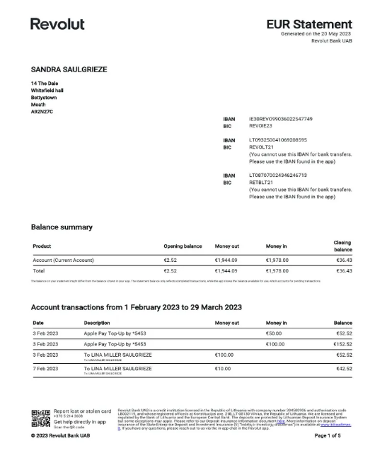
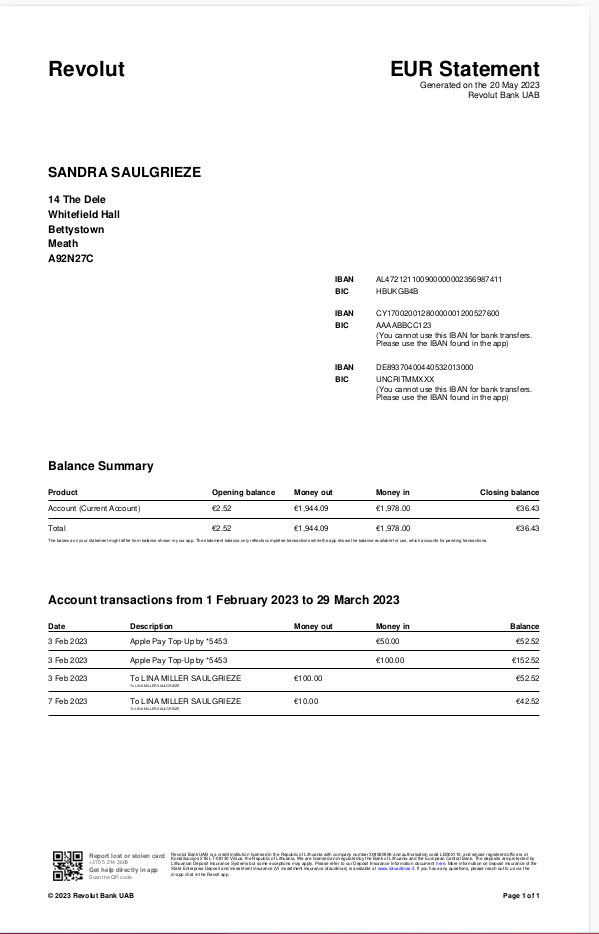

## Generate PDF
Generate a pdf with a layout similar to the pdf image below:
<p align="center">
  
</p>

### Requirements
- Latest Go version
- An IDE

### Clone Repo and Install Dependencies
```azure
~/platnova/pdf: git clone https://github.com/slamchillz/platnova.git

# Install and update dependencies
~/platnova/pdf: go mod tidy
```

### Build the binary
This builds the application source code and produces a binary **platnova** in the project's root.
```azure
~/platnova/pdf: make build
```

### Usage
- Ensure dir [data/mock](./data/mock/) exist
- Then run the following command:
```azure
~/platnova/pdf: ./platnova
```
- If successful, the result can be found at [result/report/account_statement.pdf](result/report/account_statement.pdf)
- If failed, Logs will be displayed.

### Result Sample
<p align="center">
  
</p>
